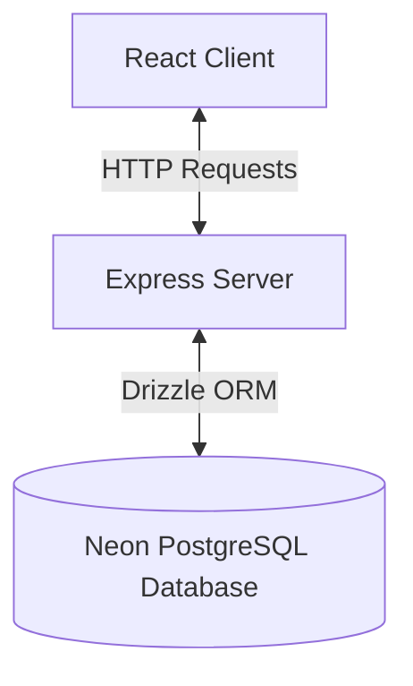

# Rate-Limited URL Shortener with Analytics

A full-stack URL shortener application featuring a custom, IP-based rate-limiter, real-time redirection click-tracking, and a client-side analytics dashboard.

---

## 1. How to Run the Application

The project consists of a React frontend (`client/`) and a Node/Express backend (`server/`).

### Prerequisites
- Node.js (v18 or higher)
- npm or yarn
- Access to a PostgreSQL Database (connection string)

### Running the Backend Server
1. Navigate to the `server` directory:
   ```bash
   cd server
   ```
2. Install dependencies:
   ```bash
   npm install
   ```
3. Set up your environment variables by creating a `.env` file in the `server/` directory:
   ```env
   PORT=3000
   DATABASE_URL=your_postgresql_database_url
   NODE_ENV=dev
   BASE_SHORT_URL=http://localhost:3000
   ```
4. Run migrations to initialize the database tables:
   ```bash
   npm run db:generate
   npm run db:migrate
   ```
5. Start the backend development server:
   ```bash
   npm run dev
   ```
   *The server will start listening at `http://localhost:3000`.*

### Running the Frontend Client
1. Navigate to the `client` directory:
   ```bash
   cd client
   ```
2. Install dependencies:
   ```bash
   npm install
   ```
3. Verify or configure client constants in [constants/index.ts](client/src/constants/index.ts):
   ```typescript
   export const constants = {
       SHORT_BASE_URL: "http://localhost:3000",
       API_BASE_URL: "http://localhost:3000/api/v1"
   }
   ```
4. Start the frontend development server:
   ```bash
   npm run dev
   ```
   *The application will open at `http://localhost:5173`.*

---

## 2. App Logic & Architecture Overview

The application is structured around a decoupled architecture separating frontend representation from data storage and business logic.



### Backend App Logic
- **Routing**: Handled by Express. Key requests pass through custom validation and throttling middlewares before reaching controllers.
- **Data Access Layer**: Implemented using Drizzle ORM. Database schemas are written in TypeScript and compiled into SQL migrations.
- **Shortcode Generation**: Shortcodes are generated dynamically as random 6-character strings choosing from base62 characters (`0-9`, `a-z`, `A-Z`).

### Frontend App Logic
- **URL Shortener Form**: Captures long URLs, performs client-side validation, submits them to the API, and displays the generated link with a clipboard copy utility.
- **Analytics View**: Visualizes click counts dynamically. When a link is selected, it queries click data, processes the timestamps, and paints a line chart using `react-chartjs-2` to show traffic trends over the last 7 days.

---

## 3. Custom Rate Limiter Logic

The rate limiter is a custom, database-backed implementation of the **Fixed Window** rate-limiting algorithm, avoiding third-party throttling black-box libraries.

### Key Constraints & Logic Details
- **Limit**: A maximum of **5 URL shortening requests per minute** per client IP address.
- **Mechanism**:
  1. The server identifies the client's IP from the `x-forwarded-for` header or remote socket address.
  2. It queries the `rate_limits` table to check for an existing entry matching the IP address.
  3. If no record exists, it creates one with a request count of `1` and sets a reset timestamp 60 seconds into the future (`now + 60s`).
  4. If a record exists but the current time exceeds `resetAt`, it resets the window by setting `requestCount` to `1` and resetting `resetAt` to `now + 60s`.
  5. If the current time is within the window:
     - If `requestCount` exceeds 5, it calculates `secondsRemaining` until the window resets, blocks execution, and returns a `429 Too Many Requests` response.
     - Otherwise, it increments the database `requestCount` by `1` and allows the request to proceed to the controller.

---

## 4. API Documentation

All API endpoints are prefixed with `/api/v1`.

### 1. Shorten URL
Generates a short alias for a given long URL.

* **Endpoint**: `POST /api/v1/short-url`
* **Headers**: `Content-Type: application/json`
* **Request Body**:
  ```json
  {
    "url": "https://www.google.com"
  }
  ```
* **Success Response (200 OK)**:
  ```json
  {
    "status": 200,
    "message": "URL shortened successfully",
    "data": "http://localhost:3000/EQbJ8d",
    "success": true
  }
  ```
* **Error Response (429 Rate Limit Exceeded)**:
  ```json
  {
    "status": 429,
    "message": "Too Many Requests Rate limit exceeded.",
    "data": {
      "secondsRemaining": 47
    },
    "success": false
  }
  ```

---

### 2. List All URLs
Retrieves a list of all shortened URLs and their original destinations.

* **Endpoint**: `GET /api/v1/urls`
* **Success Response (200 OK)**:
  ```json
  {
    "status": 200,
    "message": "Successfully Listed all the URLs",
    "data": [
      {
        "originalUrl": "https://www.google.com",
        "shortCode": "EQbJ8d"
      }
    ],
    "success": true
  }
  ```

---

### 3. Get URL Analytics
Fetches daily click statistics for a given shortcode over the last 7 days.

* **Endpoint**: `GET /api/v1/analytics/:code`
* **Success Response (200 OK)**:
  ```json
  {
    "status": 200,
    "message": "Successfully fetch URLs click analytics data",
    "data": [
      {
        "date": "2026-06-15",
        "clickCount": 3
      }
    ],
    "success": true
  }
  ```

---

### 4. URL Redirection
Redirects the user to their original long destination URL and logs the click.

* **Endpoint**: `GET /:code` (also supports `GET /api/v1/:code`)
* **Success Response (302 Found)**:
  - Redirects browser to original URL.
  - Header: `Location: https://www.google.com`
